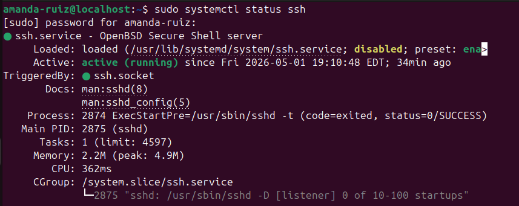
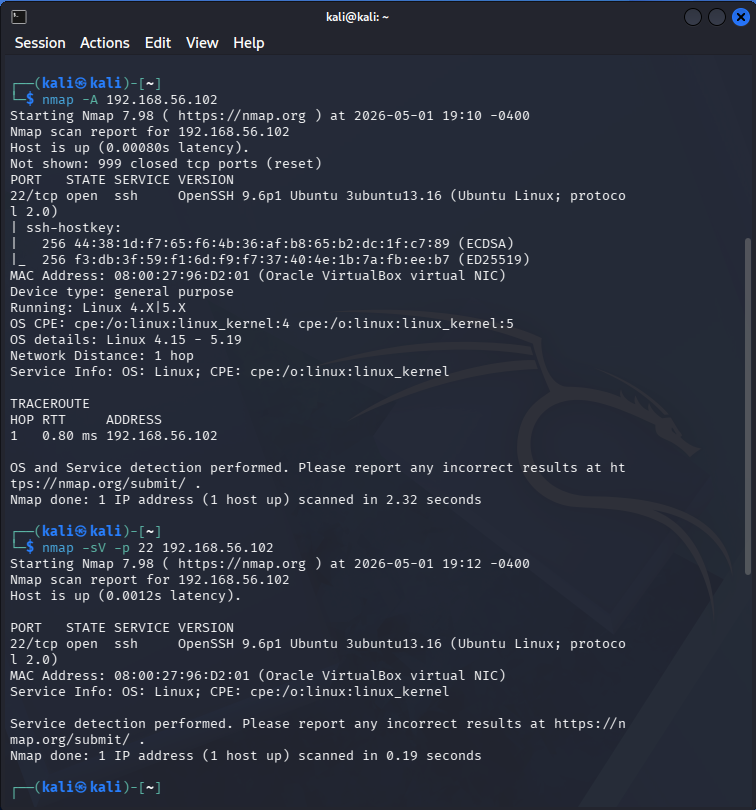

# Cybersecurity Home Lab

## Overview

I built a virtual cybersecurity home lab using Oracle VM VirtualBox to create an isolated environment for practicing networking, Linux fundamentals, and cybersecurity concepts. The lab includes Ubuntu and Kali Linux virtual machines and provides a safe environment to explore security tools, experiment with configurations, and develop hands-on technical skills while pursuing my BAS in Cybersecurity.

## Lab Environment

### Virtualization Platform
- Oracle VM VirtualBox

### Virtual Machines
- Ubuntu Linux
- Kali Linux

### Network Configuration
- Configured virtual machines using a combination of NAT and Host-Only networking
- Used NAT networking for internet access and system updates when needed
- Used a Host-Only network to create an isolated communication environment between lab machines
- Practiced networking and security concepts in a controlled environment without impacting the host system

## Purpose

The goal of this lab is to build a foundation in cybersecurity by practicing:
- Linux fundamentals
- Virtual machine management
- Networking concepts
- Security tool usage
- Troubleshooting in an isolated environment

## Tools and Skills Practiced

### Tools
- Oracle VM VirtualBox
- Ubuntu Linux
- Kali Linux
- Nmap
- SSH

### Skills Developed
- Creating and managing virtual machines
- Configuring virtual networking environments
- Working with Linux command-line tools
- Performing basic network enumeration
- Troubleshooting system and connectivity issues
- Building a safe environment for cybersecurity practice

## Lab Evidence

### Ubuntu SSH Service Configuration

Configured and verified the SSH service on an Ubuntu virtual machine using `systemctl` to check service status. This exercise helped build familiarity with Linux service management and secure remote access concepts.

Command practiced:
- `sudo systemctl status ssh`

### Network Enumeration Using Nmap

Used Kali Linux within the lab environment to perform network enumeration against a target virtual machine. Initial scanning with Nmap helped identify available services, followed by targeted service detection to examine SSH availability on port 22.

Commands practiced:
- `nmap -A <target IP>`
- `nmap -sV -p 22 <target IP>`

## Challenges and Lessons Learned

Building this lab helped me better understand how cybersecurity concepts connect together in a practical environment. Some of the biggest learning points were configuring virtual machine networking, troubleshooting connectivity, and becoming more comfortable working with Linux environments.

This project reinforced the importance of understanding foundational concepts such as networking, operating systems, and system administration before moving into more advanced security topics.

## Future Improvements

As I continue developing my cybersecurity skills, I plan to expand this lab by adding additional exercises and tools, including:

- More structured Linux administration practice
- Network traffic analysis exercises
- Vulnerability assessment practice
- Additional virtual machines for security testing
- Documentation of cybersecurity challenges and labs from platforms such as TryHackMe and Hack The Box
